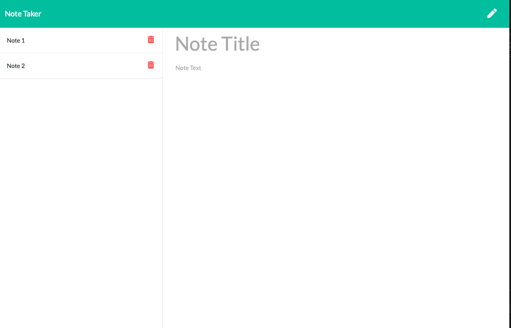

# Express Note Taker

## Description
  This web application allows you to view, save and delete notes.  The current version does not have a DB connection, and the notes are saved in a colocated .json file.
  
  
  
  ## Table of Contents
  * [Installation](#installation)
  * [Usage](#usage)
  * [License](#license)
  * [Questions](#questions)
  
  ## Installation
  This application is hosted by Heroku and does not require installation on your local client.  

  [Link to Deployed Application](https://glacial-escarpment-03703.herokuapp.com)
  
  ## Usage
  The application starts on the main page. Clicking "Get Started" will move you to the notes page.  You can add notes by entering a title and typing in the text area.  When ready, click the save icon to save your note.  This will cause the note to clear off the main part of the page and be added to the list on the left. You can click on the delete button associated with each note when you no longer need it and are ready to remove it from the page.
  
  

  ## License
  MIT
  
  
  ## Questions
  If you have any questions, please send them to me through GitHub or email.

  Github Username: sfunk11

  [borley1@gmail.com](mailto:borley1@gmail.com)
